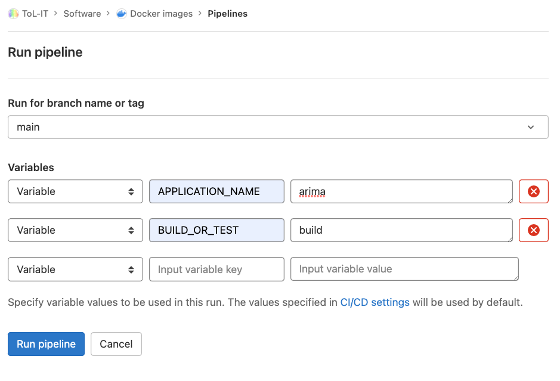

# docker-images

Registry of docker containers and dockerfiles for any software that isn't available as a container publicly.

Any docker images you don't want to publish publicly, we keep in Sanger GitLab:  
https://gitlab.internal.sanger.ac.uk/tol-it/software/docker-images/container_registry  

Otherwise you can choose one of public registries:  
quay.io/sanger-tol  
ghcr.io/sanger-tol

For test docker images:  
https://gitlab.internal.sanger.ac.uk/tol-it/software/docker-images-test/container_registry

## Structure
Each application has a dedicated directory contaning a Dockerfile and anything else required to build the image.

To avoid you pass the docker build parameters from command line, you can create a file called ```docker_build_parameters```

When building the image, the argument TAG will be defined with the application version number required.
So the ```Dockerfile``` should contain ARG TAG and can rely on the value of $TAG to be populated with the version number.

The Dockerfile is versioned separartely from the application version number,
in case the container needs to be changed independently from the application version;
recommend you start at 1 and increment each time the Dockerfile is changed _without_ a change of application version.

Docker tags are based on the application version, with the container version as a suffix;
e.g. the first version of a container for an an application v3.2 would be tagged `3.2-c1`.

## Prerequisite
The following environment variables need to be set to use the scripts below:
* DOCKER_USER this would be the GitLab, GitHub or Quay login, ie your login. This can be robot account from quay.
* DOCKER_TOKEN this would be access token with the right permission

If you build the image as production, the git repository needs to be tagged.
Therefore, the following two variables needs to be set as well:
* GITLAB_USER this would be the GitLab git repo username, it could be the same as DOCKER_USER in GitLab
* GITLAB_TOKN this would be access token with the write-permission, it could be the same as DOCKER_TOKEN in GitLab

## Docker image building for tests
The script ```test.sh``` will
* build the docker image
* push the image to our test remote gitlab docker registry

Usage:
```
./test.sh <application> [--app_version <app version>] [--container <container version>]
```
Example:
```
./test.sh arima
./test.sh arima --app_version 0.001
```
This will push the docker image `arima:0.001`.

Adding `--container 2` would add a container version suffix to the tag,
and push `arima:0.001-c2`.

## Docker image building for production
The script ```build.sh``` will
* build the docker image
* push the image to our remote gitlab or quay docker registry
* tag the git repo (so we could rebuild the image should we lose the registry)
* push the git tag to the remote git repository

*Important:* because this creates a git tag, make sure your merge request(s)
are completed before running this script.

Usage:
```
./build.sh <application> [--app_version <app version>] [--container <container version>] [--registry <registry name>]
```
Example:
```
./build.sh arima --app_version 0.001
```
This will push the docker image `arima:0.001`, and push the git tag `arima/0.001`

Adding `--container 2` would add container version suffixes, pushing
the docker image `arima:0.001-c2` and git tag `arima/0.001-c2`

## Passing extra docker build arguments
If `test.sh` or `build.sh` are run with additional arguments (i.e. following the
positional application), other than `--container`, `--app_version`, `--registry`
these additional arguments are passed to the `docker build` command.

Examples:
```
./build.sh arima --app_version 0.001 --no-cache --build-arg "BUILD_PARAM=whatever"
./build.sh arima --app_version 0.001 --container 2 --no-cache --build-arg "BUILD_PARAM=whatever"
./build.sh arima --app_version 0.001 --no-cache --build-arg "BUILD_PARAM=whatever --container 2"
```
These would all add `--no-cache --build-arg "BUILD_PARAM=whatever"` to the docker build command.  This is
useful if you have an arbitrary `ARG` in your Dockerfile that you want to be able to set at build time.

## Run test and build using GitLab CI
### Prerequisite
The following GitLab CI/CD varialbes needs to set:
* APPLICATION_NAME default 'empty', change to the application folder name in GitLab UI
*
* BUILD_OR_TEST default 'test', change to 'build' in GitLab UI if needed.
*
* GITLAB_DOCKER_USER use them to push test images to Sanger GitLab and git tagging when building
* GITLAB_DOCKER_TOKEN use them to push test images to Sanger GitLab and git tagging when building
*
* CI_REGISTRY_USER use them to push production images to Sanger GitLab, no need to be set, pre-set by GitLab CI
* CI_REGISTRY_PASSWORD use them to push production images to Sanger GitLab, no need to be set, pre-set by GitLab CI
*
* QUAY_DOCKER_USER use them to push images to quay.io
* QUAY_DOCKER_TOKEN use them to push images to quay.io
*
* GITHUB_DOCKER_USER use them to push images to ghcr.io
* GITHUB_DOCKER_TOKEN use them to push images to ghcr.io

### Build Docker images automatically by GitLab CI/CD pipeline
Building or testing pipeline for your application should be triggered automatically when you add or updte an application and push or make a merge request.

1. Create a new branch from the main branch.
2. Add your Dockerfile in a newly created directory usisng the above insturction.
3. Or update the Dockerfile and related files, in this case, don't forget to update the app_versio or container_version for build parameters.
4. Make a merge request from your branch to the main branch once you finish:  
   https://gitlab.internal.sanger.ac.uk/tol-it/software/docker-images/-/merge_requests
5. Check GitLab CI/CD pipeline is running:  
   https://gitlab.internal.sanger.ac.uk/tol-it/software/docker-images/-/pipelines
6. Your testing Docker images should be built and pushed here:  
   https://gitlab.internal.sanger.ac.uk/tol-it/software/docker-images-test/container_registry
7. If anything fails, update your branch and repeat step 4-5.
8. Ask somebody to approve your merge request and your Docker images should be built and pushed automatically by GitLab.
9. Check and use your Docker images from the Docker image registry your defined, either GitHub, GitLab or Quay.
10. For any reason, building or pushing docker image in step 7 may fail:
    * You can re-run the above GitLab steps.
    * or start the pipeline manually using GitLab Run Pipeline user interface.

### GitLab Run Pipeline user interace (manually run)
Use the following user interface to build docker image by setting some variables using the form.  
https://gitlab.internal.sanger.ac.uk/tol-it/software/docker-images/-/pipelines/new

* Docker image building for tests
  * Select the right branch
  * APPLICATION_NAME = your_application_name
* Private Docker image building for production
  * Only can select `main` branch
  * APPLICATION_NAME = your_application_name
  * BUILD_OR_TEST = build
* Public Docker image building for production
  * Only can select `main` branch
  * APPLICATION_NAME = your_application_name
  * BUILD_OR_TEST = build

  Note: if this is your first time to create a docker image repository in quay.io, you need to make it public in their website.
  this is also true for ghcr.io.

  

## GitHub mirroring
This repository is mirrored in GitHub: https://github.com/sanger-tol/docker-images
